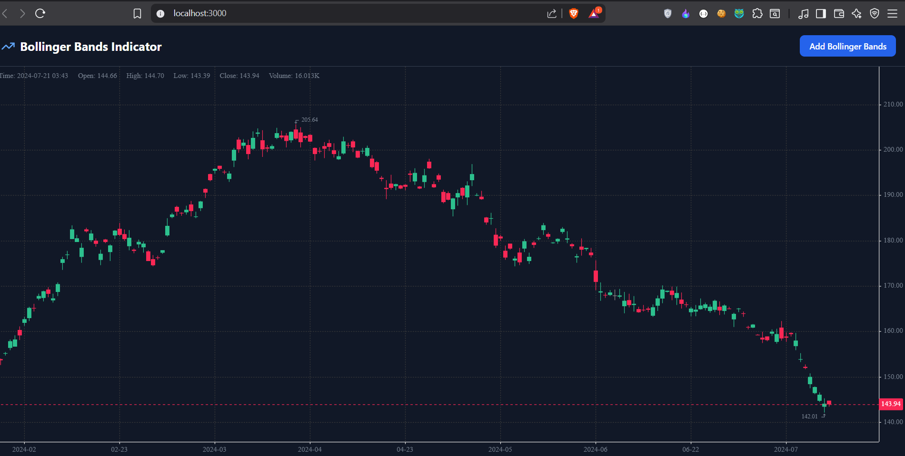
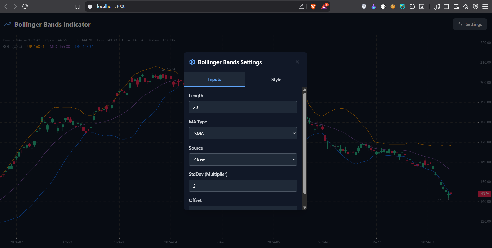

# Bollinger Bands Indicator - FindScan Frontend Intern Assignment

Production-ready Bollinger Bands indicator using KLineCharts with React, Next.js, TypeScript, and TailwindCSS.

## Setup Instructions

```bash
npm i && npm run dev
```

Open [http://localhost:3000](http://localhost:3000) to view the application.

## Formulas & Implementation

- **Basis**: SMA(close, 20)
- **Upper**: Basis + (2 × StdDev)  
- **Lower**: Basis - (2 × StdDev)
- **Offset**: Shifts bands by N bars

**Standard Deviation**: Uses **sample standard deviation** (divides by n-1), which is standard in financial analysis.

## KLineCharts Version
```json
"klinecharts": "^9.8.5"
```

## Features

- All mandatory settings: Length (20), MA Type (SMA), Source (Close), StdDev (2), Offset (0)
- TradingView-inspired Settings UI with Inputs/Style tabs
- Real-time updates on setting changes
- Customizable colors, line styles, and background fill
- 250+ demo OHLCV candles included

## Screenshots




## Live Demo

[Vercel Deployment URL]

---

**Tech Stack**: React + Next.js + TypeScript + TailwindCSS + KLineCharts only